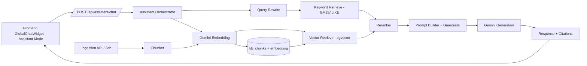

# Step 2 - Advanced RAG Architecture (Embed -> Retrieve -> Rerank) cho TechXchange

## 1. Muc tieu cua buoc 2
- Chot kien truc ky thuat cho AI Assistant trong app hien tai.
- Tach ro AI chat khoi luong chat user-shop de khong anh huong feature dang chay.
- San sang cho buoc implement o Step 3 ma khong phai redesign.

## 2. Kien truc tong quan



## 3. Thanh phan chinh

### 3.1 Frontend (da co san khung)
- Dung `GlobalChatWidget` mode `assistant` (da ton tai trong codebase).
- Them goi API moi:
  - `POST /api/assistant/chat`
- Hien thi:
  - Tin nhan assistant
  - Nguon tham chieu (citations)
  - Trang thai loading / loi

### 3.2 Backend Assistant API
- Route de xuat:
  - `POST /api/assistant/chat` (auth)
  - `POST /api/assistant/ingest` (admin)
  - `POST /api/assistant/reindex` (admin)
  - `GET /api/assistant/health` (optional)
- Controller/Service de xuat:
  - `assistantController.js`
  - `assistantService.js`
  - `ragOrchestrator.js`
  - `embeddingProvider/geminiEmbedding.js`
  - `generationProvider/geminiGeneration.js`
  - `retriever/hybridRetriever.js`
  - `reranker/rerankService.js`

### 3.3 Data layer (Postgres)
Su dung chinh Postgres hien co, them `pgvector` de giam do phuc tap van hanh.

Bang de xuat:
1. `kb_sources`
- `id`, `name`, `source_type`, `status`, `created_at`, `updated_at`

2. `kb_documents`
- `id`, `source_id`, `title`, `uri`, `language`, `checksum`, `metadata_json`, `created_at`, `updated_at`

3. `kb_chunks`
- `id`, `document_id`, `chunk_index`, `content`, `token_count`, `embedding vector(...)`, `metadata_json`, `created_at`
- Index:
  - HNSW/IVFFLAT cho cot `embedding`
  - GIN/trigram cho `content` (keyword search)

4. `assistant_conversations`
- `id`, `user_id`, `title`, `created_at`, `updated_at`

5. `assistant_messages`
- `id`, `conversation_id`, `role(user|assistant|system)`, `content`, `citations_json`, `latency_ms`, `created_at`

6. `assistant_feedback` (optional)
- `id`, `message_id`, `user_id`, `rating`, `reason`, `created_at`

## 4. Luong online (chat runtime)

1. Nhan query + context
- Input: `message`, `conversation_id`, `mode`.
- Validate do dai, sanitize.

2. Query rewrite
- Chuan hoa query dua tren lich su 3-6 turn gan nhat.
- Tao 1 query chinh + 1-2 query phu de retrieve.

3. Embed query
- Goi Gemini Embedding API tao vector query.

4. Retrieve (hybrid)
- Vector retrieve topK=30
- Keyword retrieve topK=20
- Merge + dedupe theo `chunk_id`

5. Rerank
- Rerank top 40 -> chon top 6-10 chunk cho prompt cuoi.
- Uu tien chunk co do tin cay cao (policy/product docs chinh thuc).

6. Generation
- Prompt bao gom:
  - System policy (khong hallucinate, khong bia gia/ton kho neu khong co du lieu)
  - User question
  - Retrieved contexts
  - Format output JSON co `answer`, `citations`, `confidence`
- Goi Gemini Generation API.

7. Post-process
- Validate output, fallback neu confidence thap.
- Luu message user/assistant vao DB.
- Tra response cho frontend.

## 5. Luong ingestion (nap du lieu)

1. Thu thap data
- Product catalog, FAQ, policy, huong dan mua hang.

2. Tien xu ly
- Loai bo HTML/ky tu rac
- Chuan hoa heading / bang / bullet

3. Chunking
- Chunk 300-600 tokens
- Overlap 10-15%
- Gan metadata: `doc_type`, `category`, `brand`, `updated_at`, `source`

4. Embed + ghi DB
- Tao embedding qua Gemini
- Upsert vao `kb_chunks`

5. Reindex
- Tao/refresh index vector + keyword

## 6. API contract de xuat

### 6.1 POST /api/assistant/chat
Request:
```json
{
  "conversation_id": 123,
  "message": "Build PC 20 trieu cho game AAA",
  "locale": "vi-VN"
}
```

Response:
```json
{
  "code": "200",
  "success": true,
  "message": "Assistant response",
  "data": {
    "conversation_id": 123,
    "answer": "...",
    "citations": [
      {
        "chunk_id": 881,
        "title": "Chinh sach bao hanh",
        "uri": "/policy/warranty",
        "score": 0.91
      }
    ],
    "usage": {
      "prompt_tokens": 0,
      "completion_tokens": 0,
      "latency_ms": 0
    }
  }
}
```

### 6.2 POST /api/assistant/ingest (admin)
- Trigger nap data cho 1 source hoac full source.

## 7. Cau hinh moi truong de xuat

```env
GEMINI_API_KEY=
GEMINI_CHAT_MODEL=
GEMINI_EMBED_MODEL=
RAG_TOPK_VECTOR=30
RAG_TOPK_KEYWORD=20
RAG_TOPK_RERANK=8
RAG_MAX_CONTEXT_TOKENS=3500
ASSISTANT_TIMEOUT_MS=12000
```

## 8. Guardrails va an toan
- Chi tra loi dua tren context retrieve.
- Neu context yeu/khong du: tra loi "khong du thong tin" + goi y user.
- Chan prompt injection co ban:
  - bo qua huong dan trai voi system policy
  - khong tiet lo system prompt/secret
- Rate limit endpoint assistant theo user.
- Log co cau truc nhung khong log secret.

## 9. Observability (bat buoc)
- Log theo request_id:
  - latency tung stage: embed/retrieve/rerank/generate
  - top chunks + score
  - confidence
- Dashboard toi thieu:
  - p50/p95 latency
  - fallback rate
  - answer acceptance (thumb up/down)

## 10. Ke hoach rollout

Phase 1 (MVP)
- Hybrid retrieve + rerank co ban
- Citations
- 1 domain: build PC + policy

Phase 2
- Personalization theo lich su click/mua
- Query routing theo intent (product/policy/order)
- Prompt cache + semantic cache

Phase 3
- Multi-turn planning agent
- Tool calling (tra ton kho gia thuc)

## 11. Quyet dinh ky thuat can chot truoc khi code Step 3
1. Vector DB: Postgres + pgvector (de xuat)
2. Rerank: cross-encoder service hay Gemini-based rerank
3. Scope data ingestion MVP: 
   - product catalog + FAQ + policy (de xuat)
4. Chi so danh gia offline: bo 50-100 cau hoi test

---

Neu ban dong y tai lieu nay, buoc tiep theo la Step 3: tao skeleton module assistant trong backend + endpoint chat dau tien + mock retrieve de test end-to-end tren widget.
